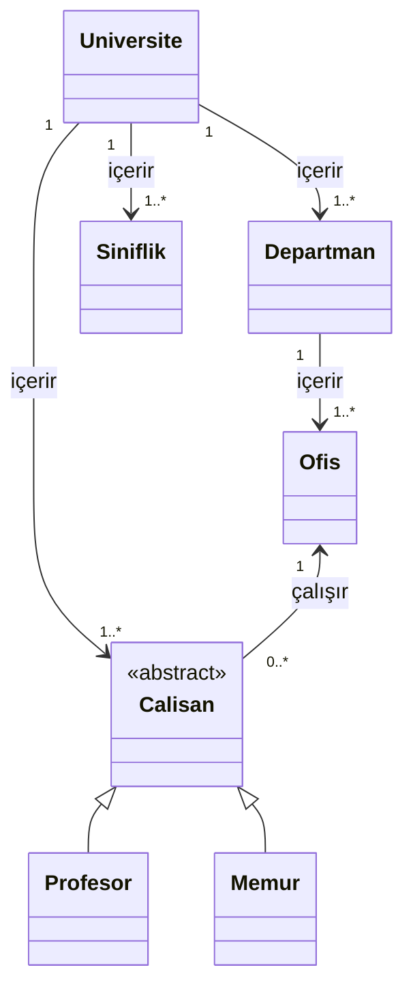

# UML Sınıf Diyagramı

Aşağıda sistemin Mermaid formatında UML sınıf diyagramı verilmiştir:

```mermaid
classDiagram
    class Universite
    class Departman
    class Ofis
    class Siniflik
    class Calisan
    class Profesor
    class Memur

    <<abstract>> Calisan

    Universite "1" --> "1..*" Departman : içerir
    Universite "1" --> "1..*" Siniflik : içerir
    Universite "1" --> "1..*" Calisan : içerir
    Departman "1" --> "1..*" Ofis : içerir
    Ofis "1" <-- "0..*" Calisan : çalışır

    Calisan <|-- Profesor
    Calisan <|-- Memur
```
