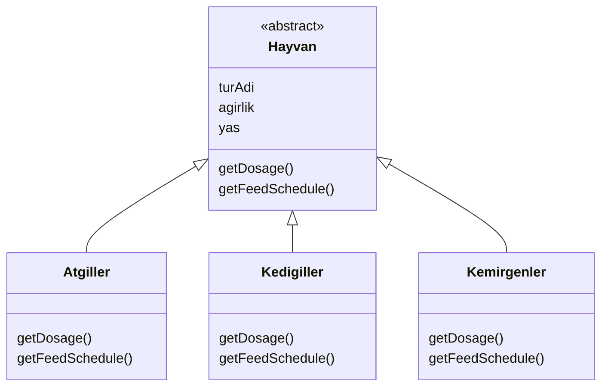

# Hayvanat Bahçesi UML Sınıf Diyagramı

Aşağıdaki diyagram, polimorfizm kullanılarak tasarlanan hayvanat bahçesi sistemini göstermektedir.

## Açıklama
- `Hayvan` soyut sınıftır.
- Tüm hayvan grupları ortak özellikleri `Hayvan` sınıfından alır.
- `getDosage()` ve `getFeedSchedule()` metotları her alt sınıfta farklı şekilde uygulanır.
- Böylece polimorfizm sağlanmış olur.
