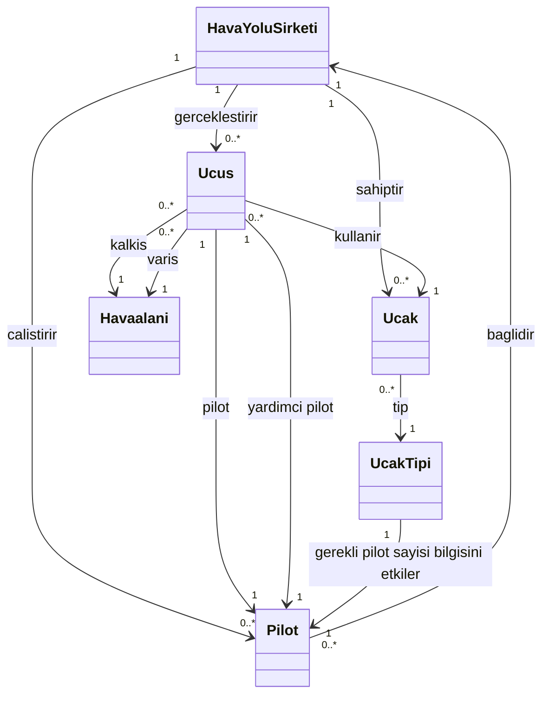

# Uçuş ve Pilot Yönetim Sistemi - UML Sınıf Diyagramı

```mermaid
classDiagram
    class HavaYoluSirketi
    class Ucak
    class UcakTipi
    class Ucus
    class Havaalani
    class Pilot

    HavaYoluSirketi "1" --> "0..*" Ucak : sahiptir
    HavaYoluSirketi "1" --> "0..*" Pilot : calistirir
    HavaYoluSirketi "1" --> "0..*" Ucus : gerceklestirir

    Ucak "0..*" --> "1" UcakTipi : tip
    Ucus "0..*" --> "1" Ucak : kullanir

    Ucus "0..*" --> "1" Havaalani : kalkis
    Ucus "0..*" --> "1" Havaalani : varis

    Ucus "1" --> "1" Pilot : pilot
    Ucus "1" --> "1" Pilot : yardimci pilot

    Pilot "0..*" --> "1" HavaYoluSirketi : baglidir
    UcakTipi "1" --> "1" Pilot : gerekli pilot sayisi bilgisini etkiler
```
