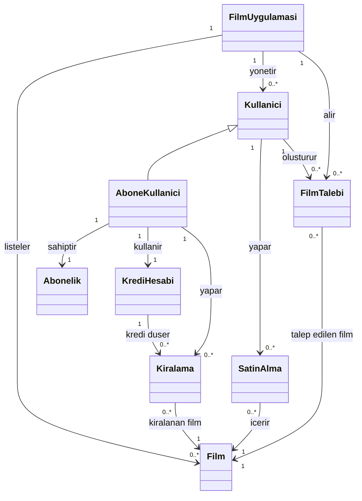

# Online Film Satış ve Kiralama Sistemi - UML Sınıf Diyagramı

```mermaid
classDiagram
    class FilmUygulamasi
    class Kullanici
    class AboneKullanici
    class Film
    class Abonelik
    class KrediHesabi
    class Kiralama
    class SatinAlma
    class FilmTalebi

    Kullanici <|-- AboneKullanici

    FilmUygulamasi "1" --> "0..*" Film : listeler
    FilmUygulamasi "1" --> "0..*" Kullanici : yonetir
    FilmUygulamasi "1" --> "0..*" FilmTalebi : alir

    Kullanici "1" --> "0..*" SatinAlma : yapar
    SatinAlma "0..*" --> "1" Film : icerir

    AboneKullanici "1" --> "1" Abonelik : sahiptir
    AboneKullanici "1" --> "1" KrediHesabi : kullanir
    AboneKullanici "1" --> "0..*" Kiralama : yapar

    Kiralama "0..*" --> "1" Film : kiralanan film
    KrediHesabi "1" --> "0..*" Kiralama : kredi duser

    Kullanici "1" --> "0..*" FilmTalebi : olusturur
    FilmTalebi "0..*" --> "1" Film : talep edilen film
```
