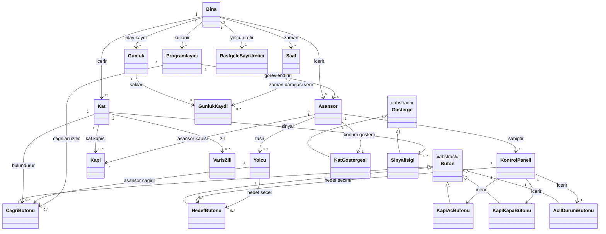

# Asansör Simülasyon Sistemi - UML Sınıf Diyagramı

```mermaid
classDiagram
    class Bina
    class Kat
    class Asansor
    class KontrolPaneli
    class Yolcu
    class Programlayici
    class Saat
    class Gunluk
    class GunlukKaydi
    class RastgeleSayiUretici
    class Kapi
    class VarisZili

    class Buton {
        <<abstract>>
    }
    class CagriButonu
    class HedefButonu
    class KapiAcButonu
    class KapiKapaButonu
    class AcilDurumButonu

    class Gosterge {
        <<abstract>>
    }
    class KatGostergesi
    class SinyalIsigi

    Buton <|-- CagriButonu
    Buton <|-- HedefButonu
    Buton <|-- KapiAcButonu
    Buton <|-- KapiKapaButonu
    Buton <|-- AcilDurumButonu

    Gosterge <|-- KatGostergesi
    Gosterge <|-- SinyalIsigi

    Bina "1" --> "12" Kat : icerir
    Bina "1" --> "5" Asansor : icerir
    Bina "1" --> "1" Programlayici : kullanir
    Bina "1" --> "1" Saat : zaman
    Bina "1" --> "1" Gunluk : olay kaydi
    Bina "1" --> "1" RastgeleSayiUretici : yolcu uretir

    Kat "1" --> "0..*" CagriButonu : bulundurur
    Kat "1" --> "0..*" Kapi : kat kapisi
    Kat "1" --> "0..*" SinyalIsigi : sinyal
    Kat "1" --> "0..*" VarisZili : zil

    Asansor "1" --> "1" KontrolPaneli : sahiptir
    Asansor "1" --> "1" Kapi : asansor kapisi
    Asansor "1" --> "1" KatGostergesi : konum gosterir
    Asansor "1" --> "0..*" Yolcu : tasir

    KontrolPaneli "1" --> "0..*" HedefButonu : hedef secimi
    KontrolPaneli "1" --> "1" KapiAcButonu : icerir
    KontrolPaneli "1" --> "1" KapiKapaButonu : icerir
    KontrolPaneli "1" --> "1" AcilDurumButonu : icerir

    Yolcu "1" --> "1" CagriButonu : asansor cagirir
    Yolcu "1" --> "0..*" HedefButonu : hedef secer

    Programlayici "1" --> "5" Asansor : gorevlendirir
    Programlayici "1" --> "0..*" CagriButonu : cagrilari izler

    Gunluk "1" --> "0..*" GunlukKaydi : saklar
    Saat "1" --> "0..*" GunlukKaydi : zaman damgasi verir
```
